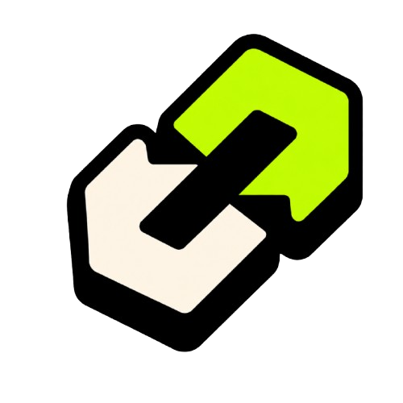
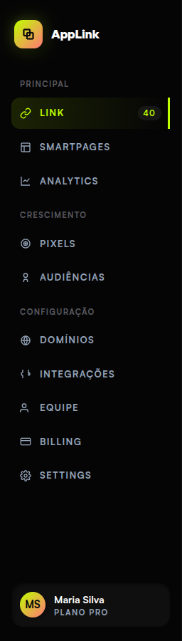
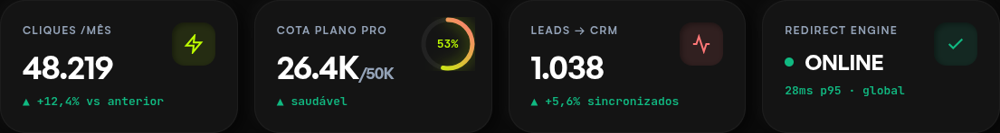
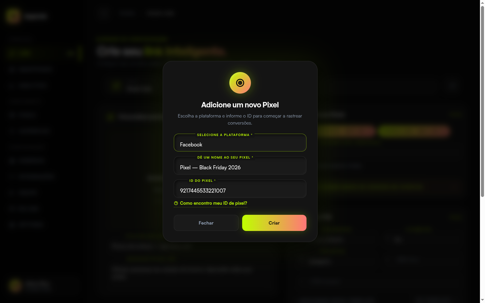
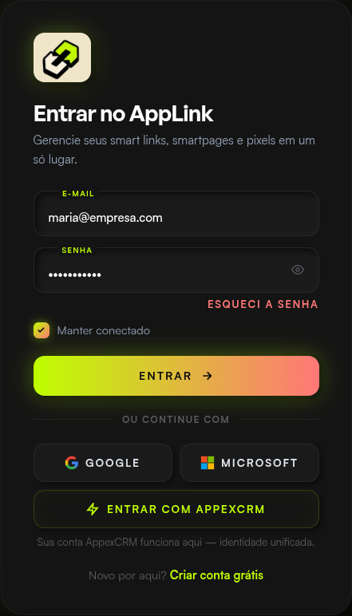
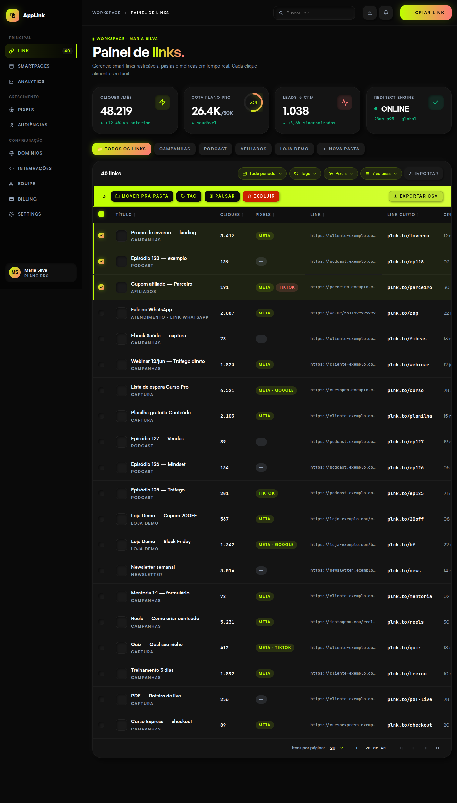
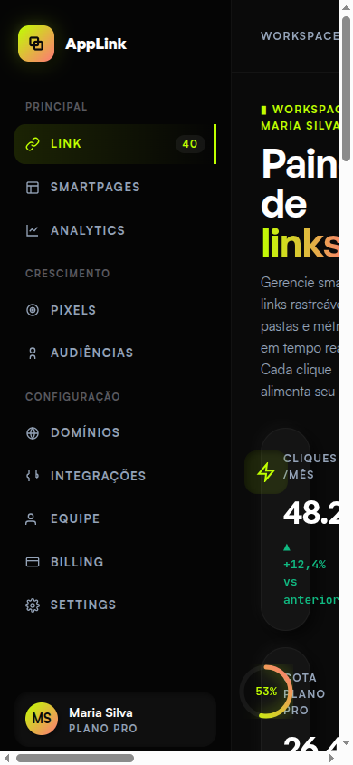

# Identidade Visual — APPlink

Documento de handoff para o time. Esta identidade foi consolidada a partir dos mockups atuais do projeto e deve ser tratada como referência de continuidade: não propõe redesign, apenas organiza o que já está aplicado.

## Essência da Marca

**Nome oficial:** APPlink

**Categoria:** ferramenta SaaS para smart links, smartpages, analytics, pixels e roteamento inteligente de links.

**Personalidade visual:** tech, direta, premium e operacional. A interface deve parecer uma ferramenta de trabalho robusta, com alto contraste, brilho controlado e elementos táteis.

**Conceito visual:** conexão + impulso. A corrente comunica link/conexão; a seta lime comunica ação, crescimento, redirecionamento e avanço.

## Logo

### Marca principal



Asset principal no projeto:

```text
brand-refs/logos/applink-logo-transparent.png
brand-refs/logos/applink-logo-transparent-2x.png
brand-refs/logos/source-logo.png
brand-refs/logos/applink-chain.svg
```

### Direção de uso

- O ícone de corrente com seta lime é a logo da ferramenta APPlink.
- A grafia oficial no texto e em lockups é **APPlink**.
- A logo pode ser usada isolada em sidebar, favicon, avatar de app, tela de login e estados de loading.
- Quando houver lockup com nome, usar ícone à esquerda e wordmark à direita.
- O wordmark deve usar **General Sans** em peso 700, com cor branca em fundos escuros.

### Área de respiro

Manter ao redor da marca uma margem mínima equivalente a 25% da altura do ícone. Em aplicações pequenas, preservar mais respiro em vez de aumentar o texto.

### Tamanho mínimo

- Interface desktop: ícone a partir de 34 px de largura.
- Sidebar: 48 x 42 px, conforme mockup atual.
- Login/onboarding: 72 x 62 px, conforme mockup atual.
- Favicon/app icon: usar apenas o símbolo, sem wordmark.

### Não fazer

- Não trocar o lime da seta por outra cor.
- Não aplicar a logo sobre fundos claros sem validar contraste.
- Não redesenhar a corrente em outro estilo.
- Não remover o contorno preto.
- Não usar gradiente na logo principal.
- Não distorcer, rotacionar ou aplicar sombra colorida excessiva.

## Paleta

### Cores principais

| Token | Hex | Uso |
|---|---:|---|
| Jet Black | `#0A0A0A` | fundo principal da aplicação |
| Sidebar Black | `#050505` | sidebar e áreas de navegação |
| Surface | `#141414` | cards, tabelas, modais |
| Surface 2 | `#1A1A1A` | botões secundários, campos, elementos elevados |
| Lime Neon | `#BFFF00` | cor primária, seleção, destaque e estados ativos |
| Coral Pink | `#FF7777` | acento secundário, links auxiliares, gradientes |

### Cores de texto

| Token | Hex | Uso |
|---|---:|---|
| Ink 1 | `#F5F5F7` | texto principal |
| Ink 2 | `#94A3B8` | texto secundário |
| Ink 3 | `#5A5A60` | labels, hints, navegação menos ativa |
| On Accent | `#0A0A0A` | texto sobre lime ou gradiente claro |

### Status

| Token | Hex | Uso |
|---|---:|---|
| Success | `#10B981` | crescimento, confirmações, variação positiva |
| Danger | `#EF4444` | erro, exclusão, alerta crítico |
| Warning | `#F59E0B` | atenção e pendências |

### Gradientes

Gradiente principal:

```css
linear-gradient(135deg, #BFFF00 0%, #FF7777 100%)
```

Gradiente horizontal para CTAs:

```css
linear-gradient(90deg, #BFFF00, #FF7777)
```

Usar gradiente em CTAs, checks, estados ativos especiais e detalhes de progressão. Não transformar a interface inteira em gradiente.

## Tipografia

### Fontes oficiais

| Função | Fonte | Peso |
|---|---|---:|
| Display / títulos | General Sans | 600-700 |
| Interface / corpo | Satoshi | 400-800 |
| Dados / números | JetBrains Mono | 400-700 |

Fallbacks atuais:

```css
--font-display: 'General Sans', 'Space Grotesk', sans-serif;
--font-ui: 'Satoshi', 'Inter', system-ui, sans-serif;
--font-mono: 'JetBrains Mono', ui-monospace, monospace;
```

### Estilo tipográfico

- Títulos grandes: General Sans, peso 600, tracking entre `-0.03em` e `-0.02em`.
- Labels e navegação: Satoshi, uppercase, peso 700-800, tracking entre `0.10em` e `0.14em`.
- Números de KPI e métricas: JetBrains Mono.
- Evitar itálico como padrão de marca.
- Evitar textos longos em uppercase; reservar uppercase para rótulos, navegação e controles.

## Sistema Visual

### Superfícies

A interface usa dark neumorphism: superfícies escuras com sombra preta externa e realce branco muito sutil. A separação entre áreas vem mais de profundidade e contraste do que de bordas fortes.

Tokens de sombra atuais:

```css
--sh-card: 6px 6px 16px rgba(0,0,0,0.55), -4px -4px 10px rgba(255,255,255,0.025);
--sh-card-lg: 12px 12px 28px rgba(0,0,0,0.65), -6px -6px 14px rgba(255,255,255,0.03);
--sh-card-in: inset 4px 4px 8px rgba(0,0,0,0.55), inset -2px -2px 6px rgba(255,255,255,0.025);
```

### Bordas e raios

| Elemento | Raio |
|---|---:|
| Inputs | 14 px |
| Botões | 14 px |
| Cards | 24-28 px |
| Modais / blocos grandes | 28-32 px |
| Pills | 999 px |

Bordas devem ser quase invisíveis, normalmente `rgba(255,255,255,0.04)` a `rgba(255,255,255,0.08)`.

### Movimento

Usar movimento rápido, tátil e com leve elasticidade:

```css
cubic-bezier(0.34, 1.56, 0.64, 1)
```

Aplicações esperadas:

- hover de botões e ícones;
- expansão de dropdowns;
- chips ativos;
- toggles;
- microinterações de cards e ações de tabela.

## Componentes

### Sidebar

- Fundo `#050505`.
- Marca no topo com ícone em container claro/creme quando aplicado como nos mockups.
- Itens de navegação em uppercase, com Satoshi 700-800.
- Estado ativo: lime `#BFFF00`, glow sutil e barra/lateral de destaque.

Referência visual:



### Header

- Altura aproximada de 80 px.
- Fundo preto com transparência e blur.
- Busca com inset shadow.
- CTAs com gradiente lime para coral.
- Ícones compactos, escuros, com hover lime.

### Cards e KPIs

- Cards em `#141414`, raio 24-28 px.
- Ícones de KPI em lime soft.
- Métricas em General Sans ou JetBrains Mono, dependendo do contexto.
- Deltas positivos em `#10B981`.
- Progress rings podem usar gradiente lime para coral.

Referência visual:



### Tabelas

- Cabeçalho em uppercase, Satoshi 800, cor `#94A3B8`.
- Linhas com separadores sutis.
- Hover com `rgba(255,255,255,0.02)`.
- Dados numéricos em JetBrains Mono.
- Ações de linha com botões iconográficos compactos.

### Formulários

- Campos com fundo escuro e sombra inset.
- Floating labels em lime no foco.
- Botão primário com gradiente lime/coral e texto `#0A0A0A`.
- Estados de foco sempre visíveis com borda lime.

Referência visual:



### Auth

- Tela centralizada, fundo `#0A0A0A`.
- Card em `#141414`, raio 28 px.
- Glow lime radial muito sutil no fundo.
- Logo grande acima do título.
- Botão primário full width com gradiente.

Referência visual:



## Aplicações de Marca

### Dashboard



O dashboard deve manter densidade operacional: KPIs, filtros, tabelas e ações rápidas. Não usar composição de landing page dentro do produto.

### Mobile



No mobile, preservar contraste, hierarquia e o uso do lime como orientação de ação. Evitar reduzir excessivamente respiro interno de cards e botões.

## Tom de Interface

### Escrita

- Direta, curta e operacional.
- Preferir verbos claros: criar, editar, copiar, ativar, pausar, analisar.
- Evitar copy promocional dentro do app.
- Usar termos consistentes: link, smartpage, pixel, audiência, domínio, integração.

### Exemplos

| Contexto | Texto recomendado |
|---|---|
| CTA principal | Criar link |
| Estado vazio | Nenhum link criado ainda |
| Ação rápida | Copiar URL |
| Confirmação | Link publicado |
| Erro | Não foi possível salvar |

## Checklist de Consistência

Antes de criar novas telas ou assets, validar:

- A logo usada é o símbolo de corrente com seta lime.
- O nome está escrito como APPlink.
- O fundo principal continua `#0A0A0A`.
- O lime `#BFFF00` é o acento principal.
- Coral `#FF7777` aparece como acento, não como cor dominante.
- Títulos usam General Sans.
- UI usa Satoshi.
- Métricas usam JetBrains Mono quando fizer sentido.
- Cards usam sombra neumórfica dupla.
- Inputs usam sombra inset.
- Interações usam o easing spring atual.
- A tela parece ferramenta operacional, não landing page.

## Arquivos de Referência

```text
mockups/assets/tokens.css
mockups/assets/ui.css
mockups/01-dashboard.html
mockups/04-login.html
brand-refs/logos/applink-logo-transparent.png
brand-refs/logos/applink-logo-transparent-2x.png
brand-refs/logos/source-logo.png
brand-refs/logos/applink-chain.svg
brand-refs/01-dashboard.png
brand-refs/mobile-dashboard.png
```
